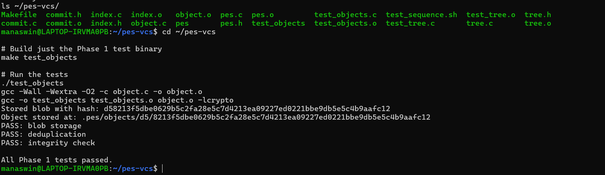
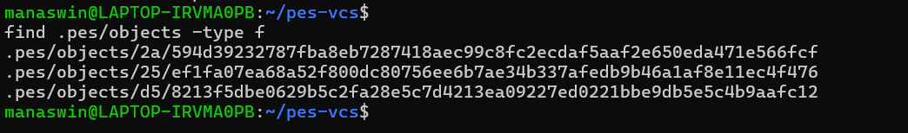
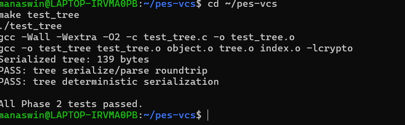
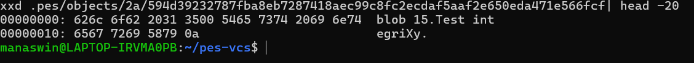
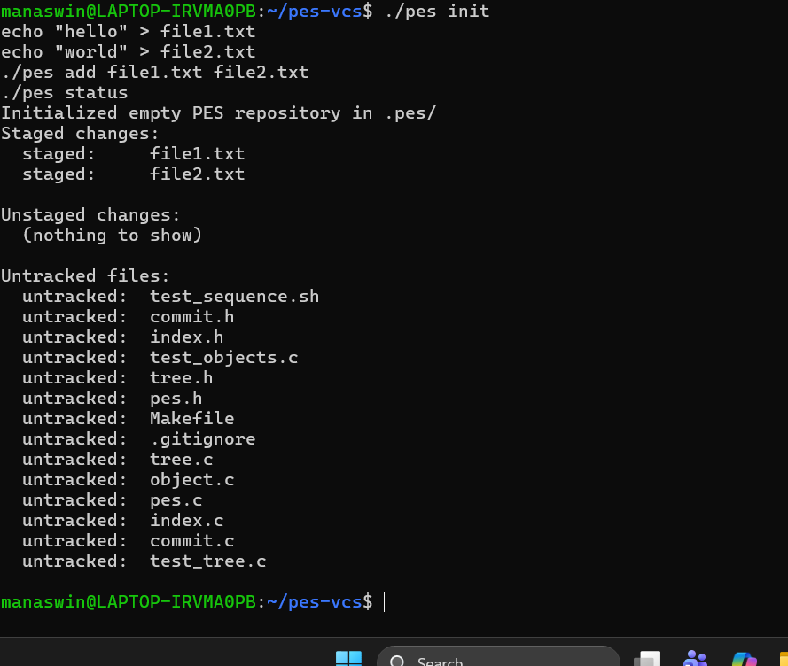
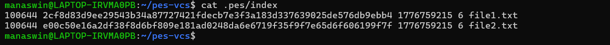
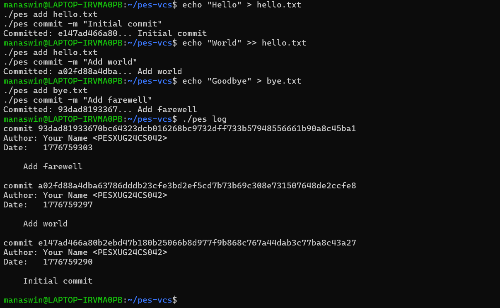
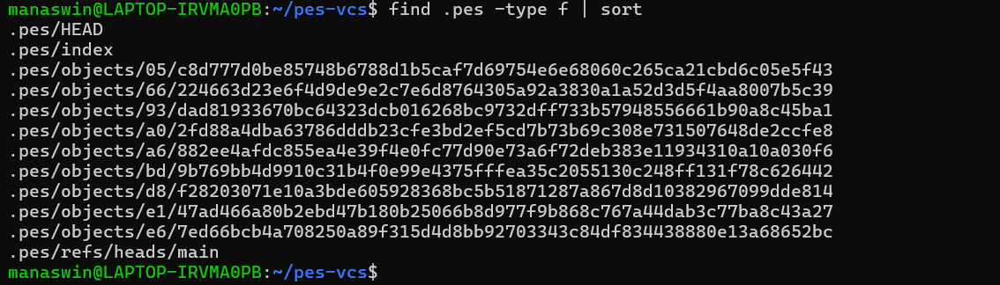
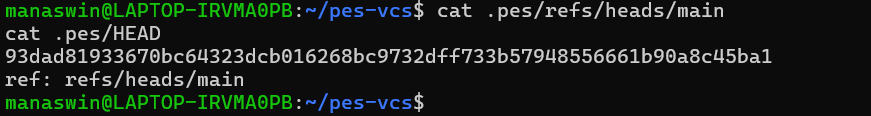
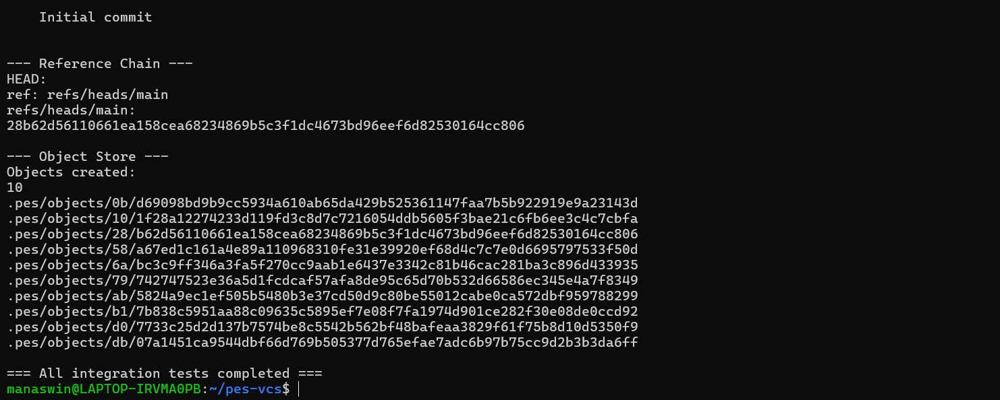

# PES-VCS Lab Report

**Name:** Manaswin HK  
**SRN:** PES1UG24AM108  
**GitHub Repo:** https://github.com/ManaswinHK/PES1UG24AM108-pes-vcs

---

## Phase 1 — Object Store

### Screenshot 1A — `./test_objects` output showing all tests passing

### Screenshot 1B — `find .pes/objects -type f` showing sharded directory structure

---

## Phase 2 — Tree Objects

### Screenshot 2A — `./test_tree` output showing all tests passing

### Screenshot 2B — `xxd` of a raw tree object (first 20 lines)

---

## Phase 3 — Index / Staging Area

### Screenshot 3A — `pes init → pes add → pes status` sequence

### Screenshot 3B — `cat .pes/index` showing the text-format index

---

## Phase 4 — Commit & Log

### Screenshot 4A — `pes log` output with three commits

### Screenshot 4B — `find .pes -type f | sort` showing object growth

### Screenshot 4C — `cat .pes/refs/heads/main` and `cat .pes/HEAD`

### Screenshot Final — Full integration test (`make test-integration`)

---

## Phase 5 — Analysis Questions

### Q5.1 — Implementing `pes checkout <branch>`

To implement `pes checkout <branch>`, the following must happen:

**Files that change in `.pes/`:**
- `.pes/HEAD` — updated to `ref: refs/heads/<branch>`
- `.pes/index` — replaced with the target commit's file list

**Steps:**
1. Check if `.pes/refs/heads/<branch>` exists, error if not
2. Read the target commit hash from the branch file
3. Parse the target commit object to get the root tree hash
4. Recursively walk the target tree and write each blob's content to the working directory
5. Delete files present in the current tree but not in the target tree
6. Replace the index with the target tree's file list
7. Write `ref: refs/heads/<branch>` to `.pes/HEAD`

**What makes it complex:**
- **Dirty working directory**: if a tracked file has uncommitted changes that would be overwritten, checkout must refuse
- **Untracked file conflicts**: if an untracked file would be overwritten, abort
- **Recursive trees**: trees can nest arbitrarily deep, requiring full recursion
- **No atomicity**: updating working directory + index + HEAD is not one atomic operation — partial failure corrupts the repo

---

### Q5.2 — Detecting Dirty Working Directory

**Algorithm using only the index and object store:**

1. **Find files that differ between current HEAD and target branch:**
   - Read both commit objects and compare tree hashes
   - Recursively compare trees to find per-file differences

2. **For each file that differs between branches:**
   - Compute the SHA-256 hash of the current on-disk file contents
   - Compare against the blob hash stored in the index
   - If they differ → file has local modifications → refuse checkout to prevent data loss

3. **For staged changes:**
   - Compare each index entry's blob hash against the HEAD tree's blob hash for that path
   - If they differ, the file is staged but not yet committed → warn or refuse

**Fast path optimization:**
- Use `mtime` and `size` from the index as a stat cache
- Only rehash files whose `mtime` or `size` has changed since staging
- This avoids rehashing all files on every operation

---

### Q5.3 — Detached HEAD

**What happens when committing in detached HEAD state:**
- HEAD contains a raw commit hash instead of `ref: refs/heads/<branch>`
- `head_update` writes the new commit hash directly into HEAD
- No branch file is updated to point to the new commit
- The commit is stored in the object store but is **orphaned** — reachable only from HEAD directly
- If you later run `pes checkout main`, HEAD becomes `ref: refs/heads/main` and the orphaned commits have no reference pointing to them

**How to recover orphaned commits:**
1. **Remember the hash**: Create a new branch pointing to it: `git branch recovery-branch <commit-hash>`
2. **Reflog**: Git maintains `.git/logs/HEAD` — a log of every position HEAD has been at. Even after moving away, reflog shows the old hash.
3. **`git fsck --lost-found`**: Scans all objects and finds those unreachable from any branch. Once garbage collection runs, however, orphaned objects are permanently deleted.

---

### Q6.1 — Garbage Collection Algorithm

**Mark and Sweep algorithm:**

**Mark phase** — find all reachable objects:
- Start with all branch refs (`.pes/refs/heads/*`) and HEAD
- For each commit: mark it reachable, then add its tree and parent to the worklist
- For each tree: mark it reachable, then recursively mark all blobs and subtrees
- Use a hash set for O(1) insert and lookup

**Sweep phase** — delete unreachable objects:
- Walk all files in `.pes/objects/*/*`
- Reconstruct the object hash from the directory + filename
- If the hash is NOT in the reachable set, delete the file

**Data structure:** Hash set mapping `ObjectID → bool` with O(1) operations

**Object count for 100,000 commits, 50 branches:**
- Assuming 20 files/commit, 10% changing per commit → ~2 new blobs per commit
- Commits: 100,000 | Trees: ~100,000 | Blobs: ~200,000
- **Total ≈ 400,000 objects to visit** in both the mark and sweep phases

---

### Q6.2 — GC Race Condition

**The race condition:**

| Time | Thread A (commit) | Thread B (GC) |
|------|-------------------|---------------|
| T1 | Writes new blob X to disk | |
| T2 | | Starts mark phase — reads all branch refs |
| T3 | | New commit not in any branch yet → blob X not marked |
| T4 | | Sweep phase: deletes blob X |
| T5 | Creates tree + commit referencing blob X | |
| T6 | **CORRUPTION**: commit points to deleted object | |

**How real Git avoids this:**

1. **Grace period** (`gc.pruneExpire`, default 2 weeks): Objects newer than the threshold are never deleted. In-progress commits always produce recently created objects that fall within the grace window.
2. **Lock files**: Git uses `.lock` files during ref updates. GC detects running operations via stale lock files and aborts if another operation is in progress.
3. **Conservative marking**: GC marks objects reachable from all reflog entries (not just branch tips), which includes recent uncommitted work.
4. **`gc.auto` threshold**: GC only triggers when loose object count exceeds a threshold, making the concurrent window rare.
5. **Pack `.keep` files**: Objects being actively packed get `.keep` files that prevent GC from touching the corresponding pack.
